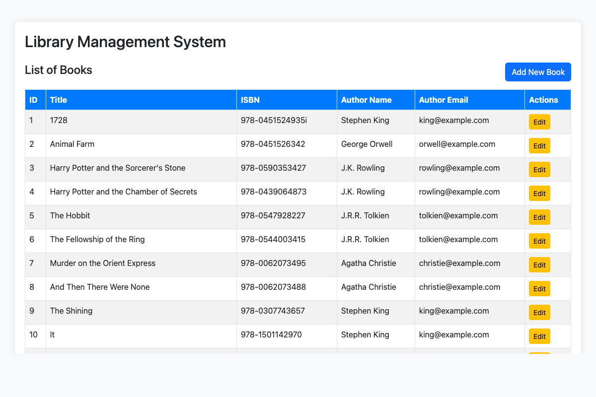
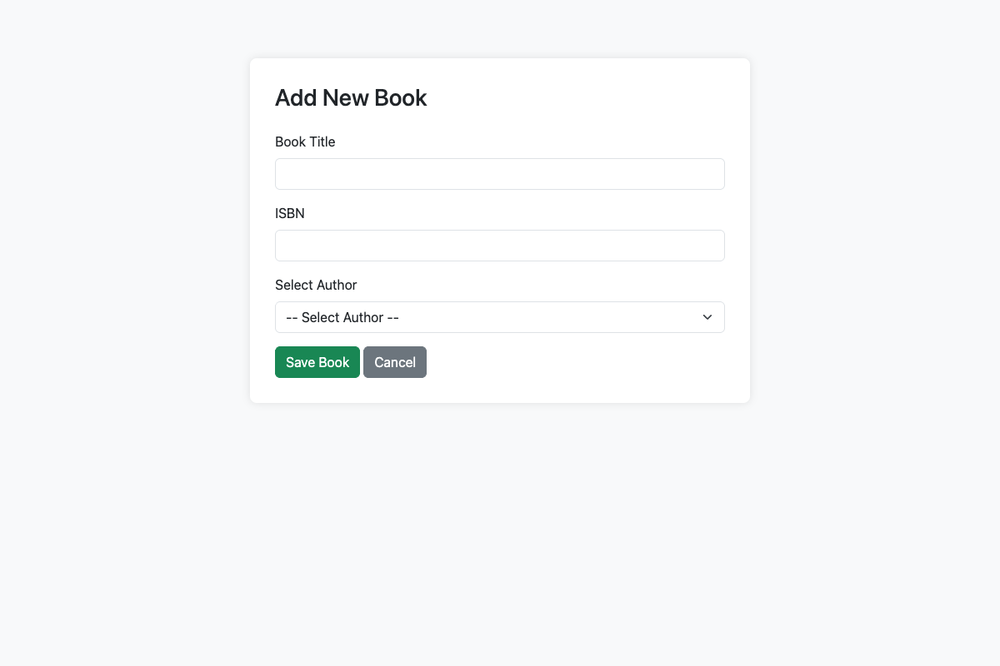
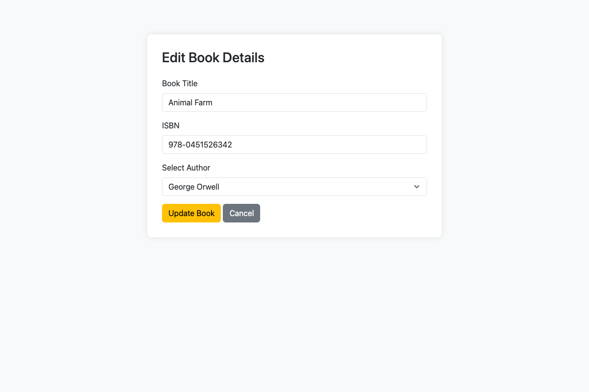

# Spring Boot Library Management Assignment

**Student Name:** MD Kaif Molla
**Roll No:** 2024eb02411
**Github URL:** https://github.com/WhySeriousKaif/library-management-assignment

## 1. Entity Relationship Design

For this assignment, I chose to implement a Library Management System focusing on two entities: `Author` and `Book`.

- **Relationship**: One-to-Many (`@OneToMany` and `@ManyToOne`). An Author can have multiple Books, but each Book belongs to only one Author.
- **Constraints**: 
  - `Author`: `id` (Primary Key), `name` (Not Null), `email` (Not Null).
  - `Book`: `id` (Primary Key), `title` (Not Null), `isbn` (Unique, Not Null), `author_id` (Foreign Key).

This is represented using JPA annotations in Spring Boot:
```java
// In Author.java
@OneToMany(mappedBy = "author", cascade = CascadeType.ALL, fetch = FetchType.LAZY)
private List<Book> books = new ArrayList<>();

// In Book.java
@ManyToOne(fetch = FetchType.LAZY, optional = false)
@JoinColumn(name = "author_id", nullable = false)
private Author author;
```

## 2. Implementation Details

### A. Populate Database
The application uses an H2 in-memory database. A `CommandLineRunner` bean in the main `Application` class executes on startup to populate 10 authors and 10 books.

```java
@Bean
public CommandLineRunner loadData(AuthorRepository authorRepository, BookRepository bookRepository) {
    return (args) -> {
        if (authorRepository.count() == 0) {
            // Authors and Books initialization...
        }
    };
}
```

### B. Create Operation
A JSP page `create.jsp` contains a form to add a new book and select its author. The controller handles the form submission using `@ModelAttribute` and calls the `LibraryService` to save the data. Exception handling prevents duplicate ISBNs.

```java
@PostMapping("/create")
public String createBook(@ModelAttribute Book book, Model model) {
    try {
        libraryService.saveBook(book);
        return "redirect:/";
    } catch (Exception e) {
        model.addAttribute("error", "Error creating book: " + e.getMessage());
        model.addAttribute("authors", libraryService.getAllAuthors());
        return "create";
    }
}
```

### C. Read Operation
The index page `list.jsp` lists all books. The data is fetched using a custom JPQL query in `BookRepository` that performs an inner join with the `Author` table.

```java
// BookRepository.java
@Query("SELECT b FROM Book b JOIN FETCH b.author")
List<Book> findAllBooksWithAuthors();
```

### D. Update Operation
Clicking "Edit" on a book navigates to `update.jsp` containing a pre-filled form. The form submission updates the entity via the `saveBook` service method.

```java
@PostMapping("/update")
public String updateBook(@ModelAttribute Book book, Model model) {
    try {
        libraryService.saveBook(book);
        return "redirect:/";
    } catch (Exception e) {
        // Handle constraint violations
        return "update";
    }
}
```

## 3. Testing

Unit tests were written using **JUnit 5** and **Mockito**:
- `BookRepositoryTest`: Tested the custom query using `@DataJpaTest`.
- `LibraryServiceTest`: Tested business logic and mock interactions with the repositories.

All operations were also tested manually in the browser.

## 4. Screenshots

**Screenshot 1: List of Books (Read Operation)**


**Screenshot 2: Add New Book Form (Create Operation)**


**Screenshot 3: Edit Book Form (Update Operation)**


## 5. Challenges Faced

1. **JSP Rendering in Spring Boot**: Modern Spring Boot favors Thymeleaf over JSP. Configuring Tomcat Embed Jasper required ensuring correct dependency scope (`tomcat-embed-jasper` and JSTL) and defining view resolvers in `application.properties`.
2. **Inner Join vs Cartesian Product**: Initially, reading books without a JOIN caused the N+1 select problem. Solving this required writing a custom `@Query` using `JOIN FETCH` to eagerly load authors efficiently.
3. **Database Constraints Handling**: Handling unique constraint violations (like duplicate ISBN) during the Create/Update forms gracefully without crashing the app required using `try-catch` blocks in the controllers and displaying error messages to the view layer.
